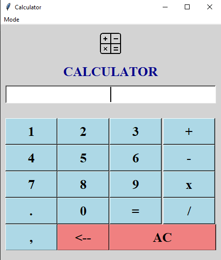
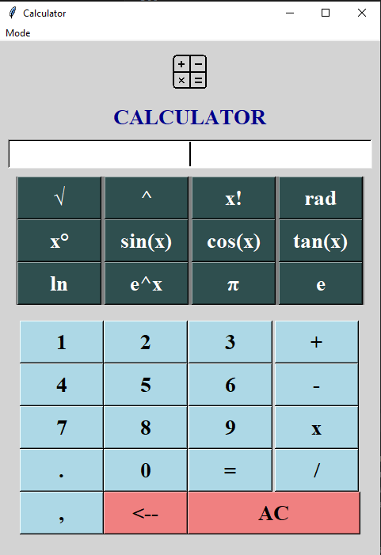
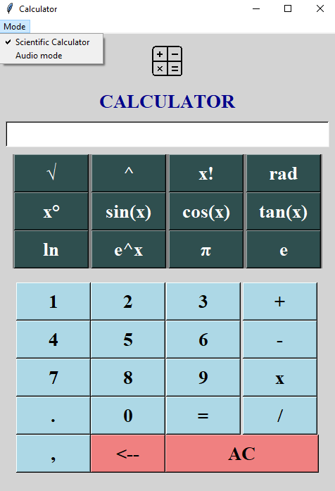

# Advanced Python Calculator

A feature-rich desktop calculator application built with Python's Tkinter GUI framework, offering both standard and scientific calculation modes with optional audio feedback.


## 🚀Features

### ✅Standard Calculator Mode
- Basic arithmetic operations (+, -, ×, ÷)
- Decimal point support
- Memory functions (AC, Clear)
- Keyboard input support (Enter key)
- Clean, intuitive interface

### 🧪Scientific Calculator Mode
- Advanced mathematical functions:
  - Square root (√)
  - Power operations (^)
  - Factorial (x!)
  - Trigonometric functions (sin, cos, tan)
  - Logarithmic functions (ln, e^x)
  - Angle conversions (radians ↔ degrees)
  - Mathematical constants (π, e)

### 🔊Audio Mode
- Text-to-speech functionality for all operations
- Audio feedback for button clicks and results
- Toggle on/off capability
- Supports mathematical symbol pronunciation

### 🎨User Interface
- Responsive design with mode switching
- Professional color scheme
- Clear visual hierarchy
- Menu-driven options
- Optional image branding support
## 💻Installation

### Prerequisites
- Python 3.6 or higher(🐍)
- tkinter (usually included with Python)
- pyttsx3 (for audio functionality)

### Setup Instructions

1. Clone the repository:
   ```bash
   git clone https://github.com/faaiz-ahmed/python-scientific-calculator.git
   cd python-calculator
   ```

2. Install dependencies:
   ```bash
   pip install pyttsx3
   ```

3. Optional: Add branding image
   - Create an `imgg` folder in the project directory
   - Add a `keys.png` file for the calculator icon

4. Run the application:
   ```bash
   python main.py
   ```
## 📁Project Structure

📁calculator/

├──  main.py              # Main application file

├── audio.py             # Audio functionality module

├── imgg/                # Image assets (optional)

│   └── keys.png         # Calculator icon

└── README.md           # Project documentation
## 🧠Usage

### 🧮Basic Operations
1. Launch the calculator by running `python main.py`
2. Use mouse clicks or keyboard input for calculations
3. Press Enter or click "=" to execute calculations
4. Use "AC" to clear all or "←" to delete last character

### 🔬Scientific Mode
1. Access via **Mode → Scientific Calculator** in the menu
2. Additional functions become available in the expanded interface
3. Use specific input formats:
   - Power: `base,exponent` then click "^"
   - Trigonometric: Enter angle in degrees, then click function

### 🔈Audio Mode
1. Enable via **Mode → Audio mode** in the menu
2. Calculator will speak button presses and results
3. Toggle off anytime through the same menu

## 🎯 Key Features Explained

### Thread-Safe Audio System
- Uses threading to prevent UI blocking during speech
- Implements locking mechanism for concurrent access prevention
- Graceful fallback when audio system unavailable

### Error Handling
- Comprehensive exception handling for mathematical errors
- User-friendly error messages
- Input validation for scientific functions

### Keyboard Support
- Enter key for calculation execution
- Full keyboard navigation support
- Responsive input field


## 🔧 Technical Details

### Dependencies
- **tkinter**: GUI framework (standard library)
- **pyttsx3**: Text-to-speech engine
- **math**: Mathematical operations (standard library)
- **threading**: Concurrent audio processing (standard library)

### Architecture
- **Modular design**: Separate audio module for maintainability
- **Event-driven**: GUI responds to user interactions
- **Thread-safe**: Audio operations don't block the main thread

### Supported Operations
- **Basic**: Addition, subtraction, multiplication, division
- **Scientific**: Square root, power, factorial, trigonometry, logarithms
- **Constants**: π (pi), e (Euler's number)
- **Conversions**: Radians to degrees and vice versa


## 📚 Supported Operations

- **Basic**: `+`, `-`, `×`, `÷`
- **Scientific**: `√`, `^`, `!`, `sin`, `cos`, `tan`, `ln`, `eˣ`
- **Constants**: `π`, `e`
- **Conversions**: radians ↔ degrees
## Known Issues

- Audio functionality requires pyttsx3 installation
- Image loading depends on file path existence
- Some scientific functions require specific input formats## 📸 Screenshots

### 🧮 Standard Calculator Mode


### 🧪 Scientific Calculator Mode


### Menu


## License

[MIT](https://choosealicense.com/licenses/mit/)


## Author

- [@Faaiz Ahmed](https://github.com/faaiz-ahmed)


## Future Enhancements

- [ ] Memory storage functions (M+, M-, MR, MC)
- [ ] History of calculations
- [ ] Customizable themes
- [ ] More scientific functions
- [ ] Unit conversion capabilities
- [ ] Export calculation results
## Support

If you encounter any issues or have questions:
- Open an issue on GitHub
- Check the troubleshooting section
- Verify all dependencies are installed- Python community for excellent libraries
- Tkinter for robust GUI capabilities
- pyttsx3 developers for audio integration
